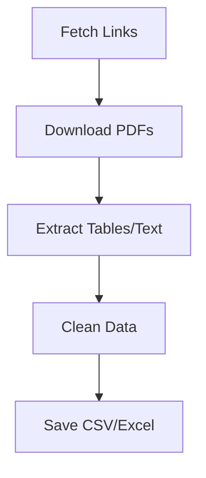

# 🚀 CBSL Trade Summary Scraper

<p align="center">
  📊 Automated Financial Data Extraction from CBSL & Treasury Reports  
</p>

<p align="center">
  
  
  
  
</p>

---

## 📌 Overview

This project is a **production-ready Python scraper** that collects and processes:

* 📥 Government Securities Trade Reports
* 📄 PDF-based financial data
* 📊 Structured outputs for analysis

From:

* CBSL (Central Bank of Sri Lanka)
* PDMO / Treasury

---

## ✨ Key Features

✅ Auto-fetch latest reports
✅ Smart PDF parsing (table + text fallback)
✅ Clean structured dataset
✅ CSV + Excel export
✅ Handles multiple formats
✅ Scalable architecture

---

## 🖥️ Demo Output

```text
Date        ISIN            Type    Tenure   Open   Close   High   Low   Avg   Volume   Trades
2026-01-02  LKA18226G030   Tbill   0.50     8.03   8.50    8.50   7.98  8.32  16547    15
```

---

## 📂 Project Structure

```bash
cbsl-scraper/
│
├── cbsl_scraper.py        # 🔥 Core scraper engine
├── cbsl_output/           # 📊 Generated results (ignored)
├── README.md
```

---

## ⚙️ Setup Guide

### 1️⃣ Clone Repository

```bash
git clone https://github.com/ScorpioCS9958/cbsl-scraper.git
cd cbsl-scraper
```

---

### 2️⃣ Create Virtual Environment

```bash
python -m venv venv
```

Activate:

```bash
# Windows
venv\Scripts\activate

# Mac/Linux
source venv/bin/activate
```

---

### 3️⃣ Install Dependencies

```bash
pip install requests beautifulsoup4 pdfplumber pandas openpyxl lxml
```

---

## ▶️ Run the Project

```bash
python cbsl_scraper.py
```

---

## 📤 Output Files

```
cbsl_output/
├── trade_summary.csv
└── trade_summary.xlsx
```

---

## 📊 Data Fields Extracted

| Field              | Description      |
| ------------------ | ---------------- |
| Date               | Report date      |
| ISIN               | Security ID      |
| Security_Type      | T-Bill / T-Bond  |
| Tenure             | Duration         |
| Opening_Yield      | Opening rate     |
| Closing_Yield      | Closing rate     |
| Highest_Yield      | Max yield        |
| Lowest_Yield       | Min yield        |
| Weighted_Avg_Yield | Avg yield        |
| Volume             | Trade volume     |
| Num_Trades         | Number of trades |

---

## ⚙️ Configuration

Modify inside `cbsl_scraper.py`:

```python
PDMO_YEARS = [2025, 2026]
MAX_REPORTS = 60
```

---

## 🧠 System Workflow



---

## 🚧 Future Enhancements

* 🔗 REST API integration
* 🗄️ MySQL database storage
* 📊 Dashboard (React / Power BI)
* ⏱️ Automated scheduling

---

## 👨‍💻 Author

**Bhashika**
💼 Scorpio Computer Solution
🚀 Full Stack Developer | Data Automation Engineer

---

## 📜 License

MIT License — Free to use and modify

---

## ⭐ Support

If you like this project, give it a ⭐ on GitHub!

